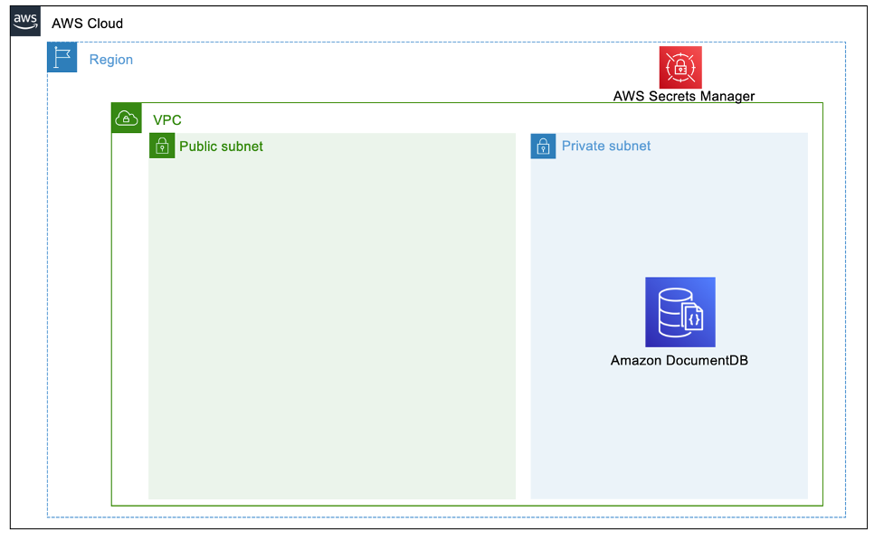

# AWS CDK DocumentDB

This example uses **AWS CDK** to deploy:

- Virtual Private Cloud (VPC)
- Security Group
- Amazon DocumentDB
- Secrets Manager

## Useful commands

- `npm run build` compile typescript to js
- `npm run watch` watch for changes and compile
- `npm run test` perform the jest unit tests
- `npx cdk deploy` deploy this stack to your default AWS account/region
- `npx cdk diff` compare deployed stack with current state
- `npx cdk synth` emits the synthesized CloudFormation template

## Reference

[Deploy a containerized application with Amazon ECS and connect to Amazon DocumentDB (with MongoDB compatibility) securely
](https://aws.amazon.com/blogs/database/deploy-a-containerized-application-with-amazon-ecs-and-connect-to-amazon-documentdb-securely/)
